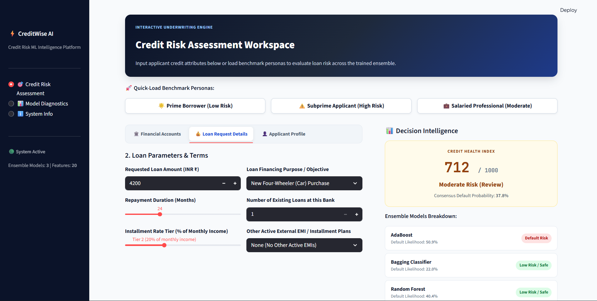
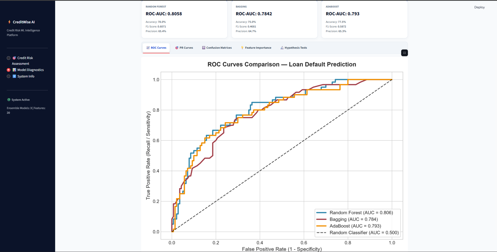

# Credit Risk Ensemble Learning

An end-to-end machine learning project for **credit-risk classification using ensemble learning**. The project trains and compares Random Forest, Bagging, and AdaBoost models, evaluates their performance using multiple metrics, and provides an interactive **Streamlit-based credit risk assessment platform**.

## 🚀 Overview

The system takes applicant credit information and uses trained ensemble models to estimate credit-risk likelihood.

```text
Credit Dataset
      ↓
Data Loading
      ↓
Preprocessing
      ↓
Model Training & Tuning
      ↓
Model Evaluation
      ↓
Saved Models
      ↓
Credit Risk Prediction
      ↓
Streamlit Web Application
```

The project is built as a modular ML pipeline rather than a single training script, making each stage reusable and testable.

---

## ✨ Features

* End-to-end credit-risk classification pipeline
* Numerical and categorical feature preprocessing
* Feature scaling and encoding
* Random Forest, Bagging, and AdaBoost models
* Hyperparameter tuning
* ROC-AUC and PR-AUC evaluation
* Accuracy, Precision, Recall and F1-Score
* Confusion matrices and ROC/PR curves
* Feature importance analysis
* Statistical hypothesis testing
* Saved model and preprocessing artifacts
* Single and batch prediction support
* Automatic saved-model discovery
* Automated pytest test suite
* Interactive Streamlit web application
* Model diagnostics dashboard

---

## 🤖 Machine Learning Models

| Model             |    ROC-AUC |  Accuracy |  F1-Score |
| ----------------- | ---------: | --------: | --------: |
| **Random Forest** | **0.8058** | **78.0%** | **60.7%** |
| AdaBoost          |     0.7930 |     77.5% |     58.7% |
| Bagging           |     0.7842 |     75.0% |     46.8% |

### Best Performing Model

**Random Forest** currently achieves the highest ROC-AUC of **0.8058** among the three evaluated ensemble models.

---

## 🌐 Web Application

The project includes a Streamlit interface called **CreditWise AI**, designed as a credit-risk assessment workspace.

### Credit Risk Assessment

The assessment page allows users to enter applicant and loan information and compare predictions from the trained ensemble models.



The interface provides:

* Financial account information
* Loan request details
* Applicant profile
* Benchmark applicant personas
* Ensemble prediction results
* Individual model probabilities
* Overall risk interpretation

The right side of the interface presents the **Decision Intelligence** section, allowing users to see how the individual ensemble models assess the same applicant.

### Model Diagnostics

The diagnostics dashboard provides visual analysis of model performance.



It includes:

* ROC curve comparison
* Precision-Recall curves
* Confusion matrices
* Feature importance
* Hypothesis testing results

---

## 📊 Evaluation

The models are evaluated using multiple metrics rather than accuracy alone:

* **Accuracy** — overall prediction correctness
* **Precision** — correctness of positive predictions
* **Recall** — ability to identify positive cases
* **F1-Score** — balance between precision and recall
* **ROC-AUC** — overall ranking/discrimination performance
* **PR-AUC** — precision-recall performance

The current evaluation shows Random Forest performing best in ROC-AUC.

---

## 📁 Project Structure

```text
credit-risk-ensemble-learning/
│
├── app.py
├── main.py
├── README.md
├── LICENSE
├── requirements.txt
│
├── assets/
│   ├── confusion_matrices.png
│   ├── feature_importance.png
│   ├── metrics_comparison_bar.png
│   ├── precision_recall_curves.png
│   ├── roc_curves.png
│   ├── credit-risk-assessment.png
│   └── model-diagnostics.png
│
├── data/
│   ├── raw/
│   │   └── german.data
│   └── processed/
│       └── german_credit_processed.csv
│
├── models/
│   ├── adaboost_model.joblib
│   ├── bagging_model.joblib
│   ├── preprocessor.joblib
│   └── random_forest_model.joblib
│
├── reports/
│   ├── hypothesis_test_results.json
│   ├── metrics_summary.json
│   └── model_comparison.csv
│
├── src/
│   ├── config.py
│   ├── data_loader.py
│   ├── evaluate.py
│   ├── hypothesis_testing.py
│   ├── predict.py
│   ├── preprocessing.py
│   ├── train.py
│   └── __init__.py
│
└── tests/
    ├── test_config.py
    ├── test_data_loader.py
    ├── test_evaluate.py
    ├── test_predict.py
    ├── test_preprocessing.py
    └── test_training.py
```

### Important modules

| Module                  | Responsibility                                  |
| ----------------------- | ----------------------------------------------- |
| `data_loader.py`        | Loads and validates the dataset                 |
| `preprocessing.py`      | Prepares numerical and categorical features     |
| `train.py`              | Trains and tunes ensemble models                |
| `evaluate.py`           | Calculates metrics and generates visualizations |
| `hypothesis_testing.py` | Performs statistical model comparison           |
| `predict.py`            | Handles model loading and predictions           |
| `app.py`                | Streamlit web application                       |
| `main.py`               | Runs the ML pipeline                            |

---

## 🛠️ Tech Stack

**Language**

* Python

**Machine Learning**

* Scikit-learn
* Random Forest
* Bagging
* AdaBoost

**Data Processing**

* Pandas
* NumPy

**Visualization**

* Matplotlib
* Seaborn

**Web Application**

* Streamlit

**Testing**

* Pytest

**Model Persistence**

* Joblib

---

## ▶️ Run the Project

### 1. Install dependencies

```bash
pip install -r requirements.txt
```

### 2. Run the ML pipeline

```bash
python main.py
```

This runs the data processing, model training, evaluation, and statistical analysis pipeline.

### 3. Launch the web application

```bash
streamlit run app.py
```

The Streamlit application then loads the saved models and preprocessing pipeline for interactive prediction.

---

## 🧪 Testing

The project includes automated tests covering configuration, data loading, preprocessing, training, evaluation, and prediction.

Run the complete test suite:

```bash
python -m pytest tests/
```

Current test status:

```text
26 passed
```

---

## 📦 Generated Artifacts

### Trained Models

```text
models/
```

Contains the trained ensemble models and preprocessing artifact.

### Reports

```text
reports/
```

Contains:

* Model comparison metrics
* Evaluation summary
* Statistical hypothesis-test results

### Visualizations

```text
assets/
```

Contains:

* ROC curves
* Precision-Recall curves
* Confusion matrices
* Feature importance
* Model comparison visualization

---

## 🎯 Project Objective

The goal of this project is to demonstrate a complete **machine learning engineering workflow** rather than simply training a classification model.

It combines:

**Data → Preprocessing → Training → Evaluation → Statistical Analysis → Model Persistence → Prediction → Web Application**

This makes the project suitable for demonstrating practical skills in **machine learning, Python development, model evaluation, testing, and deployment-oriented application development**.

---

## 🔮 Future Improvements

Planned future improvements include:

* Replace the current dataset with a larger and more representative credit-risk dataset
* Adapt the preprocessing pipeline to the new dataset
* Expand the feature set
* Improve model explainability
* Add additional ensemble models
* Improve probability calibration
* Add API-based model serving
* Containerize and deploy the application
* Add model monitoring and drift detection

---

## ⚠️ Disclaimer

This project is intended for **educational and portfolio purposes**.

The predictions should not be considered actual banking or lending decisions. A production credit-risk system would require additional validation, regulatory compliance, fairness analysis, security, auditability, and human oversight.

---

## 👨‍💻 Project Status

**Current Status: Complete Working ML Application**

The current version includes the complete machine-learning pipeline, trained ensemble models, evaluation and statistical analysis, automated testing, reusable prediction utilities, and an interactive Streamlit web application.
